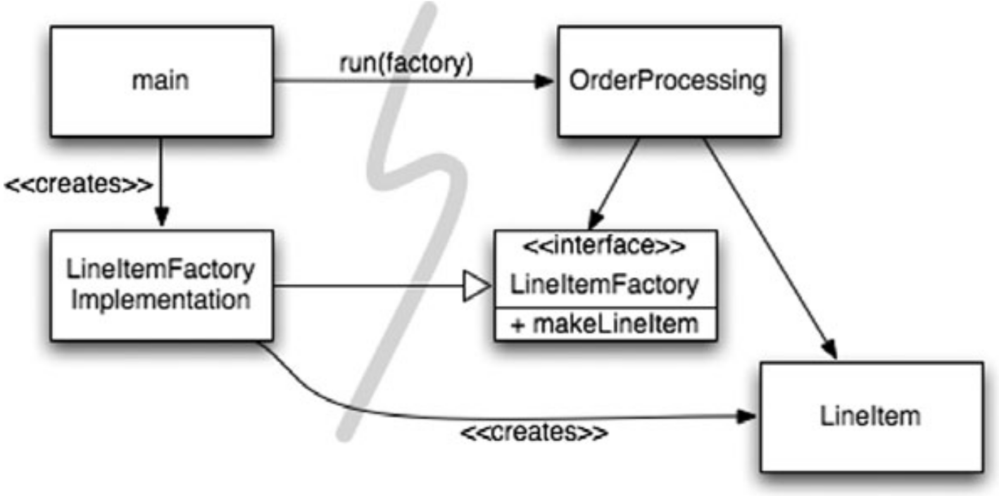

# Chapter 11: Systems

## Separate Constructing a System from Using It

_Construction_ is a very different process from _use_.

Software systems should separate the startup process, when the application objects are constructed and the dependencies are “wired” together, from the runtime logic that takes over after startup.

If we are _diligent_ about building well-formed and robust systems, we should never let little, _convenient_ idioms lead to modularity breakdown.

### Separation of Main

One way to separate construction from use is simply to move all aspects of construction to _main_, or modules called by _main_, and to design the rest of the system assuming that all objects have been constructed and wired up appropriately (see following image).

### Factories

Sometimes, of course, we need to make the application responsible for _when_ an object gets created.

In some cases we could use the Abstract Factory pattern to give the application control of when to build the items that need to be created, but keep the details of that construction separate from the application code (see following image).

### Dependency Injection

A powerful mechanism for separating construction from use is _Dependency Injection_ (DI), the application of _Inversion of Control_ (IoC) to dependency management. Inversion of Control moves secondary responsibilities from an object to other objects that are dedicated to the purpose, thereby supporting the _Single Responsibility Principle_.

## Scaling Up

It is a myth that we can get systems “right the first time.” Instead, we should implement only today’s _stories_, then refactor and expand the system to implement new stories tomorrow. This is the essence of iterative and incremental agility.

Software systems are unique compared to physical systems. Their architectures can grow incrementally, **if** we maintain the proper separation of concerns.

## Cross-Cutting Concerns

Cross-cutting concerns are the aspects regarding persistence, transactions, security, caching, failover, and so on, in the system implementation.

## Test Drive the System Architecture

Although software has its own _physics_, it is economically feasible to make radical change, if the structure of the software separates its concerns effectively.

An optimal system architecture consists of modularized domains of concern, each of which is implemented with Plain Old Java (or other) Objects. The different domains are integrated together with minimally invasive Aspects or Aspect-like tools. This architecture can be test-driven, just like the code.

## Optimize Decision Making

Modularity and separation of concerns make decentralized management and decision making possible.

The agility provided by a POJO system with modularized concerns allows us to make optimal, just-in-time decisions, based on the most recent knowledge. The complexity of these decisions is also reduced.
