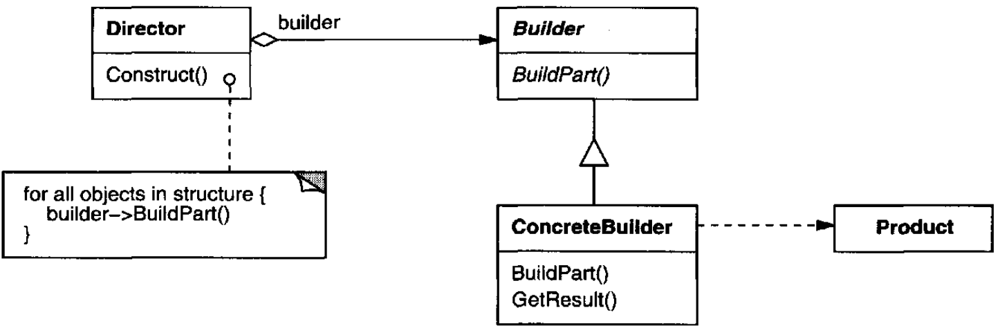
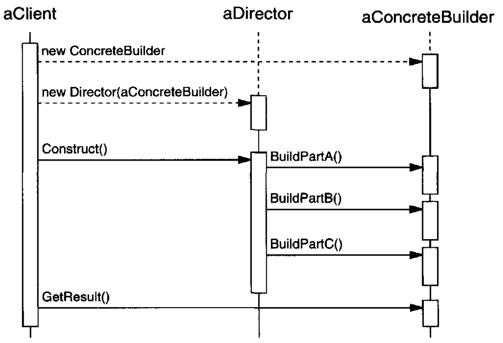
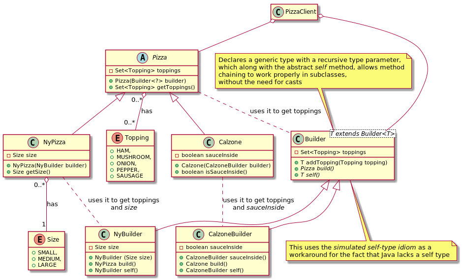

# Builder

## Intent

Separate the construction of a complex object from its representation so that the same construction process can create different representations.

## Applicability

* the algorithm for creating a complex object should be independent of the parts that make up the object and how they're assembled
* the construction process must allow different representations for the object that's constructed

## Structure



## Participants

* **`Builder`**: specifies an abstract interface for creating parts of a *Product* object
* **`ConcreteBuilder`**:
  - constructs and assembles parts of the product by implementing the Builder interface
  - defines and keeps track of the representation it creates
  - provides an interface for retrieving the product
* **`Director`**: constructs an object using the Builder interface
* **`Product``**:
  - represents the complex object under construction. `ConcreteBuilder` builds the product's internal representation and defines the process by which it's assembled
  - includes classes that define the constituent parts, including interfaces for assembling the parts into the final result

## Collaborations

* The client creates the Director object and configures it with the desired `Builder` object
* `Director` notifies the builder whenever a part of the product should be built
* `Builder` handles requests from the director and adds parts to the product
* The client retrieves the product from the builder



## Consequences

* It lets you vary a product's internal representation
* It isolates code for construction and representation
* It gives you finer control over the construction process

## Related Patterns

*Abstract Factory* is similar to *Builder* in that it may construct complex objects as well. The primary difference is that the *Builder* pattern focuses on constructing a complex object step by step. *Abstract Factory*'s emphasis is on families of product objects (either simple or complex). *Builder* returns the product as a final step but as far as the Abstract Factory pattern is concerned, the product gets returned immediately.

A *Composite* is what the builder often builds.

## Example in Java

Here are two concrete subclasses of `Pizza`, one of which represents a standard New-York-style pizza, the other a calzone. 

The former has a required `size` parameter, while the latter lets you specify whether sauce should be inside or out.

Note that the build method in each subclass’s builder is declared to return the correct subclass. This technique, wherein a subclass method is declared to return a subtype of the return type declared in the super-class, is known as *covariant return typing*. It allows clients to use these builders without the need for casting.



```
abstract class Pizza {

    enum Topping { HAM, MUSHROOM, ONION, PEPPER, SAUSAGE }

    private final Set<Topping> toppings;

    abstract static class Builder<T extends Builder<T>> {
        Set<Topping> toppings = EnumSet.noneOf(Topping.class);

        T addTopping(Topping topping) {
            toppings.add(Objects.requireNonNull(topping));
            return self();
        }

        abstract Pizza build();

        // Subclasses must override this method to return "this"
        protected abstract T self();
    }

    Pizza(Builder<?> builder) {
        toppings = EnumSet.copyOf(builder.toppings);
    }

    Set<Topping> getToppings() {
        return toppings;
    }
}

class Calzone extends Pizza {
    private final boolean sauceInside;

    static class CalzoneBuilder extends Pizza.Builder<CalzoneBuilder> {
        private boolean sauceInside; // Default to false

        CalzoneBuilder sauceInside() {
            sauceInside = true;
            return this;
        }

        @Override
        public Calzone build() {
            return new Calzone(this);
        }

        @Override
        protected CalzoneBuilder self() {
            return this;
        }
    }

    private Calzone(CalzoneBuilder builder) {
        super(builder);
        sauceInside = builder.sauceInside;
    }

    boolean isSauceInside() {
        return sauceInside;
    }
}

class NyPizza extends Pizza {

    enum Size { SMALL, MEDIUM, LARGE }

    private final Size size;

    static class NyBuilder extends Pizza.Builder<NyBuilder> {
        private final Size size;

        NyBuilder(Size size) {
            this.size = Objects.requireNonNull(size);
        }

        @Override public NyPizza build() {
            return new NyPizza(this);
        }
        @Override protected NyBuilder self() {
            return this;
        }
    }

    private NyPizza(NyBuilder builder) {
        super(builder);
        size = builder.size;
    }

    Size getSize() {
        return size;
    }
}

// ---

class PizzaClient {
    Pizza pizza = new NyPizza.NyBuilder(NyPizza.Size.SMALL)
                             .addTopping(Pizza.Topping.SAUSAGE)
                             .addTopping(Pizza.Topping.ONION)
                             .build();
    Pizza calzone = new Calzone.CalzoneBuilder()
                               .addTopping(Pizza.Topping.HAM)
                               .sauceInside()
                               .build();
}
```
