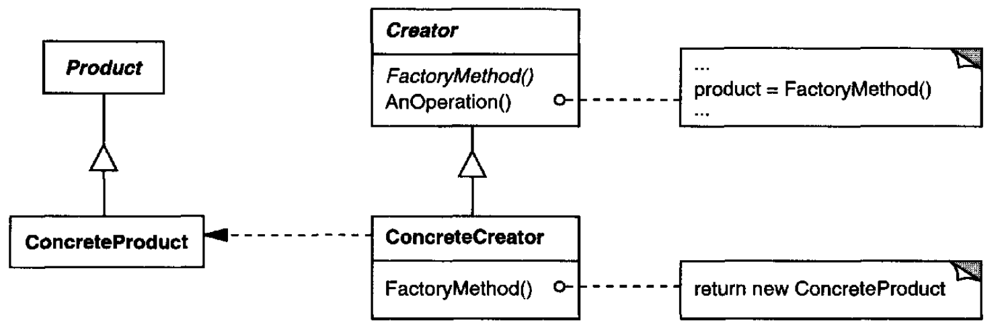
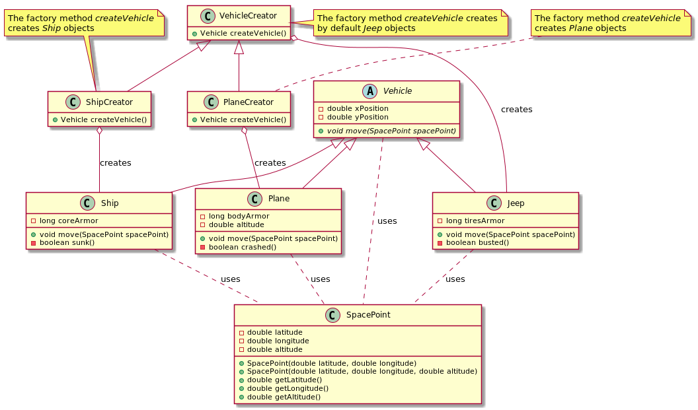

# Factory Method

## Intent

Define an interface for creating an object, but let subclasses decide which class to instantiate. Factory Method lets a class defer instantiation to subclasses.

## Also Known As

Virtual Constructor

## Applicability

* a class can't anticipate the class of objects it must create
* a class wants its subclasses to specify the objects it creates
* classes delegate responsibility to one of several helper subclasses, and you want to localize the knowledge of which helper subclass is the delegate

## Structure



## Participants

* **`Product`**: defines the interface of objects the factory method creates
* **`ConcreteProduct`**: implements the `Product` interface
* **`Creator`**:
  - declares the factory method, which returns an object of type `Product`. `Creator` may also define a default implementation of the factory method that returns a default `ConcreteProduct` object
  - may call the factory method to create a `Product` object
* **`ConcreteCreator`**: overrides the factory method to return an instance of a `ConcreteProduct`

## Collaborations

`Creator` relies on its subclasses to define the factory method so that it returns an instance of the appropriate `ConcreteProduct`

## Consequences

*Factory methods* eliminate the need to bind application-specific classes into your code. The code only deals with the `Product` interface; therefore it can work with any user-defined `ConcreteProduct` classes.

A potential disadvantage of factory methods is that clients might have to subclass the `Creator` class just to create a particular `ConcreteProduct` object. Subclassing is fine when the client has to subclass the `Creator` class anyway, but otherwise the client now must deal with another point of evolution.

Provides hooks for subclasses.

Connects parallel class hierarchies.

## Related Patterns

*Abstract Factory* is often implemented with *factory methods*.

*Factory methods* are usually called within *Template Methods*.

## Example in Java



```
abstract class Vehicle {
    double xPosition;
    double yPosition;

    abstract void move(SpacePoint spacePoint);
}

class Jeep extends Vehicle {
    private long tiresArmor = Long.MAX_VALUE;

    @Override
    void move(SpacePoint spacePoint) {
        if (spacePoint.getAltitude() > 0) {
            throw new IllegalArgumentException("A jeep can't fly");
        } else if (spacePoint.getAltitude() < 0) {
            throw new IllegalArgumentException("A jeep can't sink");
        }
        this.xPosition = spacePoint.getLatitude();
        this.yPosition = spacePoint.getLongitude();
        tiresArmor--;
    }

    private boolean busted() {
        return tiresArmor == 0;
    }
}

class Plane extends Vehicle {
    private long bodyArmor = Long.MAX_VALUE;
    double altitude;

    @Override
    void move(SpacePoint spacePoint) {
        if (spacePoint.getAltitude() < 0) {
            throw new IllegalArgumentException("A plain can't sink");
        }
        this.xPosition = spacePoint.getLatitude();
        this.yPosition = spacePoint.getLongitude();
        this.altitude = spacePoint.getAltitude();

        bodyArmor--;
    }

    private boolean crashed() {
        return bodyArmor == 0;
    }
}

class Ship extends Vehicle {
    private long coreArmor = Long.MAX_VALUE;
    double depth;

    @Override
    void move(SpacePoint spacePoint) {
        if (spacePoint.getAltitude() > 0) {
            throw new IllegalArgumentException("A ship can't fly");
        }
        this.xPosition = spacePoint.getLatitude();
        this.yPosition = spacePoint.getLongitude();
        this.depth = spacePoint.getAltitude();
        coreArmor--;
    }

    private boolean sunk() {
        return coreArmor == 0;
    }
}

class VehicleCreator {
    Vehicle createVehicle() {
        return new Jeep();
    }
}

class PlaneCreator extends VehicleCreator {
    @Override
    Vehicle createVehicle() {
        return new Plane();
    }
}

class ShipCreator extends VehicleCreator {
    @Override
    Vehicle createVehicle() {
        return new Ship();
    }
}

class SpacePoint {
    private double latitude;
    private double longitude;
    private double altitude;

    SpacePoint(double latitude, double longitude) {
        this.latitude = latitude;
        this.longitude = longitude;
    }

    SpacePoint(double latitude, double longitude, double altitude) {
        this.latitude = latitude;
        this.longitude = longitude;
        this.altitude = altitude;
    }

    double getLatitude() {
        return latitude;
    }

    double getLongitude() {
        return longitude;
    }

    double getAltitude() {
        return altitude;
    }
}
```
