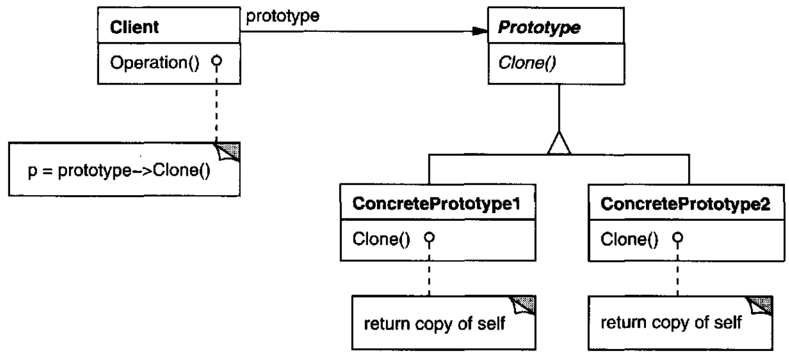
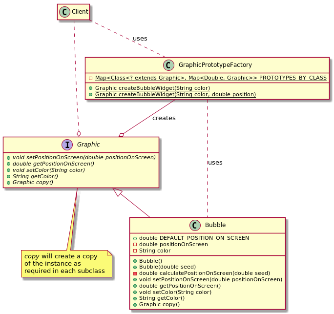

# Prototype

## Intent

Specify the kinds of objects to create using a prototypical instance, and create new objects by copying this prototype.

## Applicability

* a system should be independent of how its products are created, composed, and represented
* when the classes to instantiate are specified at run-time, for example, by dynamic loading
* to avoid building a class hierarchy of factories that parallels the class hierarchy of products
* when instances of a class can have one of only a few different combinations of state. It may be more convenient to install a corresponding number of prototypes and clone them rather than instantiating the class manually, each time with the appropriate state

## Structure



## Participants

* **`Prototype`**: declares an interface for cloning itself
* **`ConcretePrototype`**: implements an operation for cloning itself
* **`Client`**: creates a new object by asking a prototype to clone itself

## Collaborations

A client asks a prototype to clone itself

## Consequences

* It hides the concrete product classes from the client, thereby reducing the number of names clients know about. Moreover, it lets a client work with application-specific classes without modification
* It allows adding and removing products at run-time
* It allows specifying new objects by varying values
* It allows specifying new objects by varying structure
* It allows reduced subclassing
* It allows configuring an application with classes dynamically
* The main **liability** of the *Prototype* pattern is that each subclass of `Prototype` must implement the `clone` operation, which may be difficult. For example, adding `clone` is difficult when the classes under consideration already exist. Implementing `clone` can be difficult when their internals include objects that don't support copying or have circular references

## Considerations

* If possible it is better for a *client* to use a *prototype manager* to retrieve the prototype objects (from a registry) before cloning it, instead of managing the prototypes itself
* The hardest part of the *Prototype* pattern is implementing the `clone` operation correctly

## Related Patterns

*Prototype* and *Abstract Factory* are competing patterns in some ways. They can also be used together, however. An *Abstract Factory* might store a set of prototypes from which to clone and return product objects.

Designs that make heavy use of the *Composite* and *Decorator* patterns often can benefit from *Prototype* as well.

## Example in Java



```java
public interface Graphic {
    void setPositionOnScreen(double positionOnScreen);
    double getPositionOnScreen();

    void setColor(String color);
    String getColor();

    Graphic copy();
}

class Bubble implements Graphic {
    static final double DEFAULT_POSITION_ON_SCREEN = 0.0d;
    private double positionOnScreen; // i.e.: to "calculate" this value, HEAVY OPERATIONS are PERFORMED
    private String color;

    Bubble() {
        this.positionOnScreen = DEFAULT_POSITION_ON_SCREEN;
    }

    Bubble(double seed) {
        this.positionOnScreen = calculatePositionOnScreen(seed);
    }

    private double calculatePositionOnScreen(double seed) {
        return seed; // A position calculated after a heavy operation is performed which call should be minimized
    }

    @Override
    public void setPositionOnScreen(double positionOnScreen) {
        this.positionOnScreen = positionOnScreen;
    }

    @Override
    public double getPositionOnScreen() {
        return positionOnScreen;
    }

    @Override
    public void setColor(String color) {
        this.color = color;
    }

    @Override
    public String getColor() {
        return color;
    }

    @Override
    public Graphic copy() {
        Graphic graphic = new Bubble();
        graphic.setPositionOnScreen(this.positionOnScreen);     // there is a performance gain here since
                                                                // calculatePositionOnScreen need not to be called again
        return graphic;
    }
}

public class GraphicPrototypeFactory {
    private static final Map<Class<? extends Graphic>, Map<Double, Graphic>> PROTOTYPES_BY_CLASS = new HashMap<>();

    public static Graphic createBubbleWidget(String color) {
        return createBubbleWidget(color, Bubble.DEFAULT_POSITION_ON_SCREEN);
    }

    public static Graphic createBubbleWidget(String color, double position) {
        Map<Double, Graphic> prototypesByClass = PROTOTYPES_BY_CLASS.getOrDefault(Bubble.class, new HashMap<>());

        Graphic bubble = prototypesByClass.get(position);
        if (bubble == null) {
            bubble = new Bubble();
            bubble.setColor(color);
            prototypesByClass.put(position, bubble);
            PROTOTYPES_BY_CLASS.put(bubble.getClass(), prototypesByClass);
        }

        Graphic copy = bubble.copy();
        copy.setColor(color);

        return copy;
    }
}

public final class Client {

    public static void main(String[] args) {
        String BLUE = "blue";
        String GREEN = "green";
        double positionCentered = 5.5;

        // on the client's first call it will create a bubble from scratch
        Graphic greenBubbleCentered = GraphicPrototypeFactory.createBubbleWidget(GREEN, positionCentered);
        // on subsequent calls, internally it will reuse the prototype (without doing the heavy calculation for the position on screen)
        Graphic blueBubbleCentered = GraphicPrototypeFactory.createBubbleWidget(BLUE, positionCentered);
    }
}
