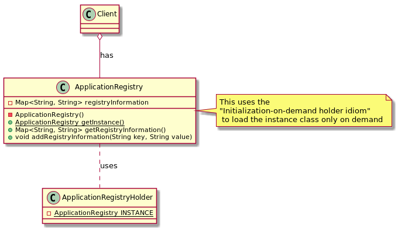

# Singleton

## Intent

Ensure a class only has one instance, and provide a global point of access to it.

## Applicability

* there must be exactly one instance of a class, and it must be accessible to clients from a well-known access point
* when the sole instance should be extensible by subclassing, and clients should be able to use an extended instance without modifying their code

## Structure


## Participants

* **`Singleton`**: defines an Instance operation that lets clients access its unique instance

## Collaborations

Clients access a Singleton instance solely through Singleton's Instance operation

## Consequences

### Benefits

* Controlled access to sole instance
* Reduced name space
* Permits refinement of operations and representation
* Permits a variable number of instances

## Related Patterns

Many patterns can be implemented using the Singleton pattern. i.e.: *Abstract Factory*, *Builder* and *Prototype*.

## Example in Java



```java
public final class ApplicationRegistry {
    private final Map<String, String> registryInformation = new HashMap<>();

    private ApplicationRegistry() {
        // forbid instantiation outside class scope
    }

    private static final class ApplicationRegistryHolder {
        static final ApplicationRegistry INSTANCE = new ApplicationRegistry();
    }

    public static ApplicationRegistry getInstance() {
        return ApplicationRegistryHolder.INSTANCE;
    }

    public Map<String, String> getRegistryInformation() {
        return Collections.unmodifiableMap(registryInformation);
    }
    public void addRegistryInformation(String key, String value) {
        registryInformation.put(key, value);
    }
}

// --

public class Client {

    public static void main(String[] args) {
        ApplicationRegistry registryInstance = ApplicationRegistry.getInstance();
        registryInstance.addRegistryInformation("os", "win");

        print(registryInstance.getRegistryInformation()); // it should include "os": "win"

        print(ApplicationRegistry.getInstance().getRegistryInformation()); // it should include "os": "win", too!
    }

    private static void print(Map<?, ?> map) {
        map.forEach((key, value) -> System.out.println(key + ": " + value));
    }
}
```
