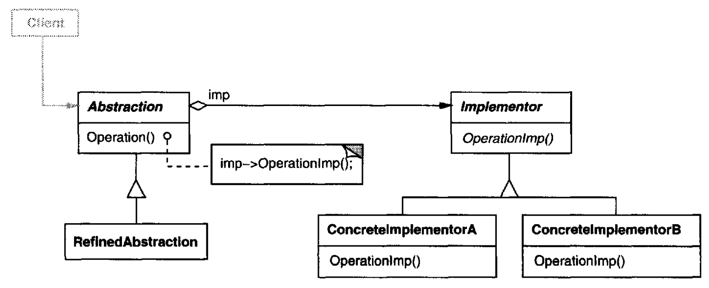
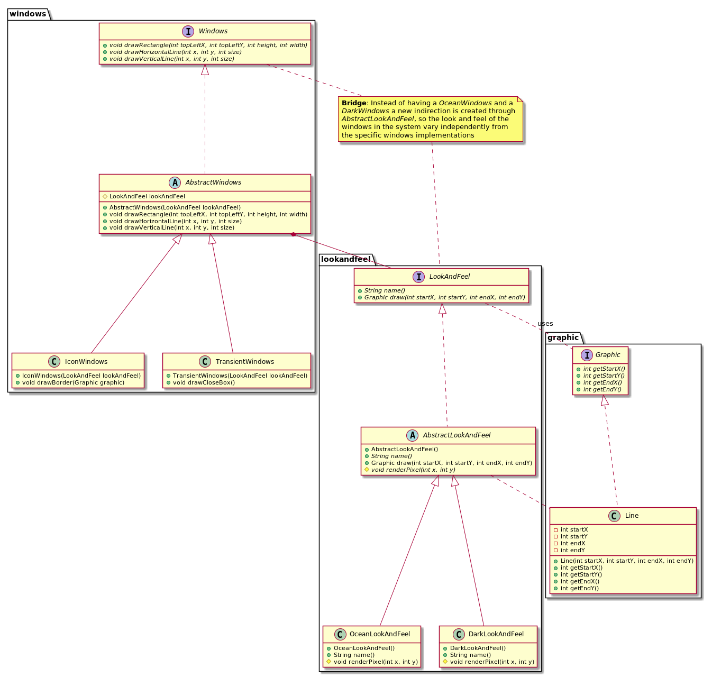

# Bridge

## Intent

Decouple an abstraction from its implementation so that the two can vary independently

## Also Known As

Handle/Body

## Applicability

* you want to avoid a permanent binding between an abstraction and its implementation. This might be the case, for example, when the implementation must be selected or switched at run-time
* both the abstractions and their implementations should be extensible by subclassing. In this case, the *Bridge* pattern lets you combine the different abstractions and implementations and extend them independently
* changes in the implementation of an abstraction should have no impact on clients; that is, their code should not have to be recompiled
* you have a proliferation of classes. Such a class hierarchy indicates the need for splitting an object into two parts. Rumbaugh uses the term "nested generalizations" to refer to such class hierarchies
* you want to share an implementation among multiple objects (perhaps using reference counting), and this fact should be hidden from the client

## Structure



## Participants

* **`Abstraction`**
  - defines the abstraction's interface
  - maintains a reference to an object of type `Implementor`
* **RefmedAbstraction**: Extends the interface defined by *Abstraction*
* **`Implementor`**: defines the interface for implementation classes. This interface doesn't have to correspond exactly to Abstraction's interface; in fact the two interfaces can be quite different. Typically the Implementor interface provides only primitive operations, and Abstraction defines higher-level operations based on these primitives
* **`Concretelmplementor`**: implements the Implementor interface and defines its concrete implementation

## Collaborations

`Abstraction` forwards client requests to its `Implementor` object

## Consequences

* Decoupling interface and implementation
* Improved extensibility
* Hiding implementation details from clients

## Related Patterns

An *Abstract Factory* can create and configure a particular *Bridge*.

The *Adapter* pattern is geared toward making unrelated classes work together. It is usually applied to systems after they're designed. *Bridge*, on the other hand, is used up-front in a design to let abstractions and implementations vary independently.


## Example in Java



```java
package graphic;

public interface Graphic {
    int getStartX();
    int getStartY();
    int getEndX();
    int getEndY();
}

public class Line implements Graphic {
    private final int startX;
    private final int startY;
    private final int endX;
    private final int endY;

    public Line(int startX, int startY, int endX, int endY) {
        this.startX = startX;
        this.startY = startY;
        this.endX = endX;
        this.endY = endY;
    }

    public int getStartX() { return startX; }
    public int getStartY() { return startY; }
    public int getEndX() { return endX; }
    public int getEndY() { return endY; }
}
```

```java
package lookandfeel;

import graphic.Graphic;
import graphic.Line;

public interface LookAndFeel {
    String name();
    Graphic draw(int startX, int startY, int endX, int endY);
}

public abstract class AbstractLookAndFeel implements LookAndFeel {
    public Graphic draw(int startX, int startY, int endX, int endY) {
        for (int i = startX; i <= endX; i++) {
            for (int j = startY; j <= endY; j++) {
                renderPixel(i, j);
            }
        }
        return new Line(startX, startY, endX, endY);
    }
    protected abstract void renderPixel(int x, int y);
}

public class OceanLookAndFeel extends AbstractLookAndFeel {
    @Override
    protected void renderPixel(int x, int y) {
        // render a screen pixel with ocean color
    }
    @Override
    public String name() {
        return "Ocean Look And Feel";
    }
}

public class DarkLookAndFeel extends AbstractLookAndFeel {
    @Override
    protected void renderPixel(int x, int y) {
        // render a screen pixel with dark color
    }
    @Override
    public String name() {
        return "Dark Look And Feel";
    }
}
```

```java
package windows;

import graphic.Graphic;
import lookandfeel.LookAndFeel;

public interface Windows {
    void drawRectangle(int topLeftX, int topLeftY, int height, int width);
    void drawHorizontalLine(int x, int y, int size);
    void drawVerticalLine(int x, int y, int size);
}

public abstract class AbstractWindows implements Windows {
    protected LookAndFeel lookAndFeel;

    public AbstractWindows(LookAndFeel lookAndFeel) {
        this.lookAndFeel = lookAndFeel;
    }

    @Override
    public void drawRectangle(int topLeftX, int topLeftY, int height, int width) {
        drawHorizontalLine(topLeftX, topLeftY, topLeftX + width);
        drawHorizontalLine(topLeftX, topLeftY + height, topLeftX + width);

        drawVerticalLine(topLeftX, topLeftY, topLeftY + height);
        drawVerticalLine(topLeftX + width, topLeftY, topLeftY + height);
    }
    @Override
    public void drawHorizontalLine(int x, int y, int size) {
        lookAndFeel.draw(x, y, x + size, y);
    }
    @Override
    public void drawVerticalLine(int x, int y, int size) {
        lookAndFeel.draw(x, y, x, y + size);
    }
}

public class IconWindows extends AbstractWindows {

    public IconWindows(LookAndFeel lookAndFeel) {
        super(lookAndFeel);
    }

    public void drawBorder(Graphic graphic) {
        drawRectangle(graphic.getStartX(),
                      graphic.getStartY(),
                      graphic.getEndY() - graphic.getStartY(),
                      graphic.getEndX() - graphic.getStartX());
    }
}

public class TransientWindows extends AbstractWindows {
    public TransientWindows(LookAndFeel lookAndFeel) {
        super(lookAndFeel);
    }

    public void drawCloseBox() {
        int topLeftCornerX = 0;
        int topLeftCornerY = 0;
        int height = 24;
        int width = 30;

        drawRectangle(topLeftCornerX, topLeftCornerY, height, width);
    }
}
```
