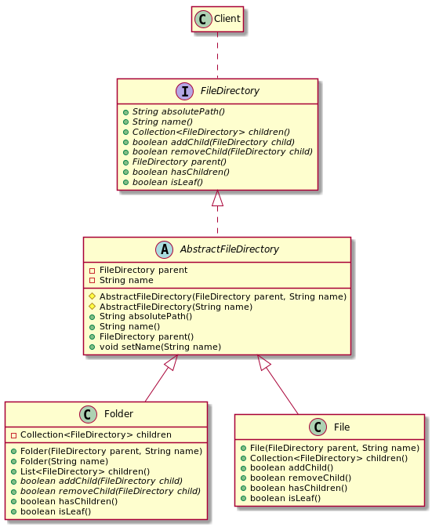

# Composite

## Intent

Compose objects into tree structures to represent part-whole hierarchies. Composite lets clients treat individual objects and compositions of objects uniformly.

## Applicability

* you want to represent part-whole hierarchies of objects
* you want clients to be able to ignore the difference between compositions of objects and individual objects. Clients will treat all objects in the composite structure uniformly

## Structure


## Participants

* **`Component`**:
  - declares the interface for objects in the composition
  - implements default behavior for the interface common to all classes, as appropriate
  - declares an interface for accessing and managing its child components
  - (optional) defines an interface for accessing a component's parent in the recursive structure, and implements it if that's appropriate
* **`Leaf`**:
  - represents leaf objects in the composition. A leaf has no children
  - defines behavior for primitive objects in the composition
* **`Composite`**:
  - defines behavior for components having children
  - stores child components
  - implements child-related operations in the `Component` interface
* **`Client`**: manipulates objects in the composition through the Component interface

## Collaborations

Clients use the Component class interface to interact with objects in the composite structure. If the recipient is a Leaf, then the request is handled directly. If the recipient is a Composite, then it usually forwards requests to its child components, possibly performing additional operations before and/or after forwarding.

## Consequences

The pattern:

* defines class hierarchies consisting of primitive objects and composite objects
* makes the client simple
* makes it easier to add new kinds of components
* can make your design overly general. The **disadvantage** of making it easy to add new components is that it makes it harder to restrict the components of a composite

## Related Patterns

Often the component-parent link is used for a Chain of Responsibility.

Decorator is often used with Composite. When decorators and composites are used together, they will usually have a common parent class. So decorators will have to support the Component interface with operations like `Add`, `Remove`, and `GetChild`.

Flyweight lets you share components, but they can no longer refer to their parents.

Iterator can be used to traverse composites.

Visitor localizes operations and behavior that would otherwise be distributed across Composite and Leaf classes.

## Example in Java



```java
public interface FileDirectory {
    String absolutePath();
    String name();
    Collection<FileDirectory> children();
    boolean addChild(FileDirectory child);
    boolean removeChild(FileDirectory child);
    FileDirectory parent();
    boolean hasChildren();
    boolean isLeaf();
}

abstract class AbstractFileDirectory implements FileDirectory {
    private FileDirectory parent;
    private String name;

    AbstractFileDirectory(FileDirectory parent, String name) {
        this.parent = parent;
        this.name = name;
    }

    AbstractFileDirectory(String name) {
        this.name = name;
    }

    @Override
    public String absolutePath() {
        String parentPath = parent() != null ? parent().absolutePath() : File.separator;
        return parentPath + File.pathSeparator + name();
    }

    @Override
    public String name() { return name; }

    @Override
    public FileDirectory parent() { return parent; }

    public void setName(String name) { this.name = name; }
}

public class Folder extends AbstractFileDirectory {
    private final Collection<FileDirectory> children = new ArrayList<>();

    public Folder(FileDirectory parent, String name) {
        super(parent, name);
    }

    public Folder(String name) {
        super(name);
    }

    @Override
    public Collection<FileDirectory> children() { return Collections.unmodifiableCollection(children); }

    @Override
    public boolean addChild(FileDirectory child) {
        this.children.add(child);
        return true;
    }

    @Override
    public boolean removeChild(FileDirectory child) {
        this.children.remove(child);
        return true;
    }

    @Override
    public boolean hasChildren() { return !children.isEmpty(); }

    @Override
    public boolean isLeaf() { return false; }
}

public class File extends AbstractFileDirectory {
    public File(FileDirectory parent, String name) { super(parent, name); }

    @Override
    public Collection<FileDirectory> children() { return Collections.emptyList(); }

    @Override
    public boolean addChild(FileDirectory child) { return false; }

    @Override
    public boolean removeChild(FileDirectory child) { return false; }

    @Override
    public boolean hasChildren() { return false; }

    @Override
    public boolean isLeaf() { return true; }
}

final class Client {
    public static void main(String[] args) {
        // the following code creates:
        /*
           A   B
          / \
         F1 FD2
             |
             X
        */
        FileDirectory root = new Folder("/");

        FileDirectory A = new Folder(root, "A");
        FileDirectory B = new Folder(root, "B");
        root.addChild(A);
        root.addChild(B);

        FileDirectory A1 = new File(A, "F1");
        FileDirectory A2 = new Folder(A, "FD2");
        A.addChild(A1);
        A.addChild(A2);

        FileDirectory A21 = new File(A2, "X");
        A2.addChild(A21);

        printDirectoryPath(root);
    }

    // utility code to print the directory structure
    static void printDirectoryPath(FileDirectory directory) {
        System.out.println(directory.absolutePath());
        if (!directory.isLeaf() && directory.hasChildren()) {
            Collection<FileDirectory> archives = directory.children();
            for (FileDirectory file : archives) {
                printDirectoryPath(file);
            }
        }
    }
}
```
