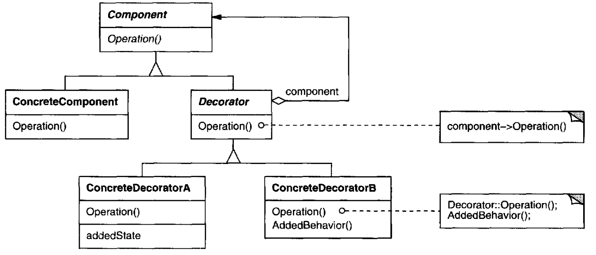
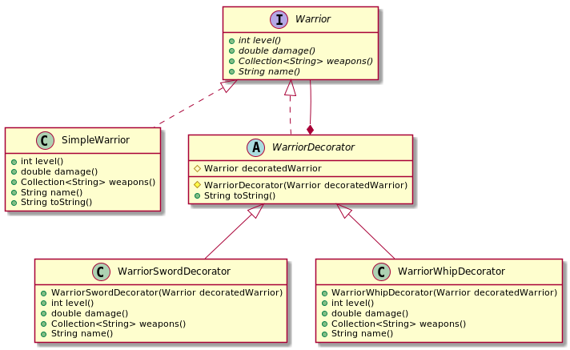

# Decorator

## Intent

Attach additional responsibilities to an object dynamically. Decorators provide a flexible alternative to subclassing for extending functionality.

## Also Known As

Wrapper

## Applicability

* to add responsibilities to individual objects dynamically and transparently, that is, without affecting other objects
* for responsibilities that can be withdrawn
* when extension by subclassing is impractical. Sometimes a large number of independent extensions are possible and would produce an explosion of subclasses to support every combination. Or a class definition maybe hidden or otherwise unavailable for subclassing

## Structure

## Participants

* **`Component`**: defines the interface for objects that can have responsibilities added to them dynamically
* **`ConcreteComponent`**: defines an object to which additional responsibilities can be attached
* **`Decorator`**: maintains a reference to a Component object and defines an interface that conforms to Component's interface
* **`ConcreteDecorator`**: adds responsibilities to the component

## Collaborations

Decorator forwards requests to its Component object. It may optionally perform additional operations before and after forwarding the request.

## Consequences

### Adventages

* More flexibility than static inheritance
* Avoids feature-laden classes high up in the hierarchy

### Disadvantages

* A decorator and its component aren't identical
* Lots of little objects

## Related Patterns

*Adapter*: A *decorator* is different from an adapter in that a decorator only changes an object's responsibilities, not its interface; an adapter will give an object a completely new interface.

*Composite*: A *decorator* can be viewed as a degenerate composite with only one component. However, a decorator adds additional responsibilities—it isn't intended for object aggregation.

*Strategy*: A *decorator* lets you change the skin of an object; a strategy lets you change the guts. These are two alternative ways of changing an object.

## Example in Java

