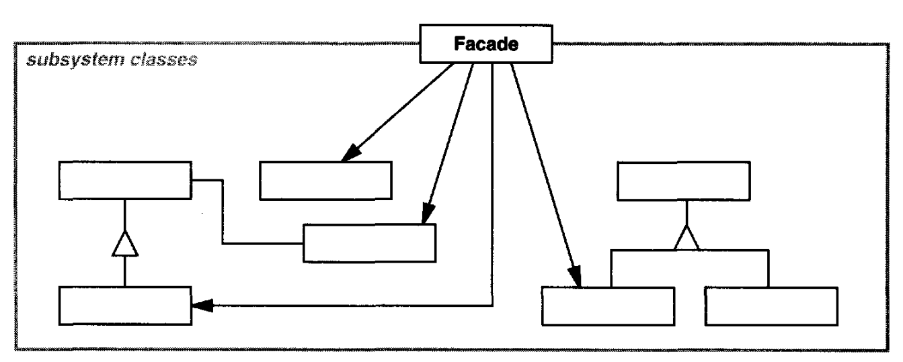
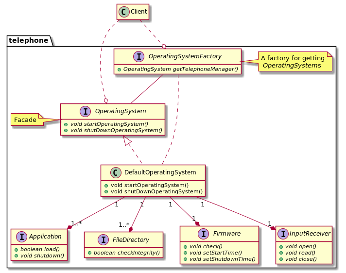

# Facade

## Intent

Provide a unified interface to a set of interfaces in a subsystem. Facade defines a higher-level interface that makes the subsystem easier to use.

## Applicability

* you want to provide a simple interface to a complex subsystem
* there are many dependencies between clients and the implementation classes of an abstraction. Introduce a facade to decouple the subsystem from clients and other subsystems, thereby promoting subsystem independence and portability
* you want to layer your subsystems. Use a facade to define an entry point to each subsystem level


## Structure



## Participants

* **`Facade`**:
  - knows which subsystem classes are responsible for a request
  - delegates client requests to appropriate subsystem objects
* **subsystem classes**:
  - implement subsystem functionality
  - handle work assigned by the Facade object
  - have no knowledge of the facade; that is, they keep no references to it
  
## Collaborations

* Clients communicate with the subsystem by sending requests to Facade, which forwards them to the appropriate subsystem object(s). Although the subsystem objects perform the actual work, the facade may have to do work of its own to translate its interface to subsystem interfaces
* Clients that use the facade don't have to access its subsystem objects directly

## Consequences

* Facade shields clients from subsystem components, thereby reducing the number of objects that clients deal with and making the subsystem easier to use
* It promotes weak coupling between the subsystem and its clients
* It doesn't prevent applications from using subsystem classes if they need to

## Related Patterns

*Abstract Factory* can be used with *Facade* to provide an interface for creating subsystem objects in a subsystem-independent way. Abstract Factory can also be used as an alternative to Facade to hide platform-specific classes.

*Mediator* is similar to *Facade* in that it abstracts functionality of existing classes. However, Mediator's purpose is to abstract arbitrary communication between colleague objects, often centralizing functionality that doesn't belong in any one of them. In contrast, a facade merely abstracts the interface to subsystem objects to make them easier to use; it doesn't define new functionality, and subsystem classes don't know about it.

Usually only one Facade object is required. Thus Facade objects are often Singletons.

## Example in Java



```java
interface Application {
    boolean load();
    void shutdown();
}

interface FileDirectory {
    boolean checkIntegrity();
}

interface Firmware {
    void check();
    void setStartTime();
    void setShutdownTime();
}

interface InputReceiver {
    void open();
    void read();
    void close();
}

public interface OperatingSystem {
    void startOperatingSystem();
    void shutDownOperatingSystem();
}

class DefaultOperatingSystem implements OperatingSystem {
    private final FileDirectory fileDirectory;
    private final Collection<Application> applications;
    private final Firmware firmware;
    private final InputReceiver inputReceiver;

    // values injected through some available dependency injection management (or using some of the other patterns)
    DefaultOperatingSystem(FileDirectory fileDirectory, Collection<Application> applications,
                           Firmware firmware, InputReceiver inputReceiver) {
        this.fileDirectory = fileDirectory;
        this.applications = new ArrayList<>(applications);
        this.firmware = firmware;
        this.inputReceiver = inputReceiver;
    }

    @Override
    public void startOperatingSystem() {
        firmware.check();
        firmware.setStartTime();

        fileDirectory.checkIntegrity();
        applications.forEach(Application::load);
        inputReceiver.open();
        inputReceiver.read();
    }

    @Override
    public void shutDownOperatingSystem() {
        inputReceiver.close();
        applications.forEach(Application::shutdown);
        fileDirectory.checkIntegrity();
        firmware.setShutdownTime();
    }
}

public interface OperatingSystemFactory {
    OperatingSystem getTelephoneManager();
}

// --

public class Client {
    public static void main(String[] args) {
        OperatingSystemFactory operatingSystemFactory = null;
        OperatingSystem operatingSystem = operatingSystemFactory.getTelephoneManager();

        operatingSystem.startOperatingSystem();
        // ... at the end of the day, shutdown
        operatingSystem.shutDownOperatingSystem();
    }
}
```
