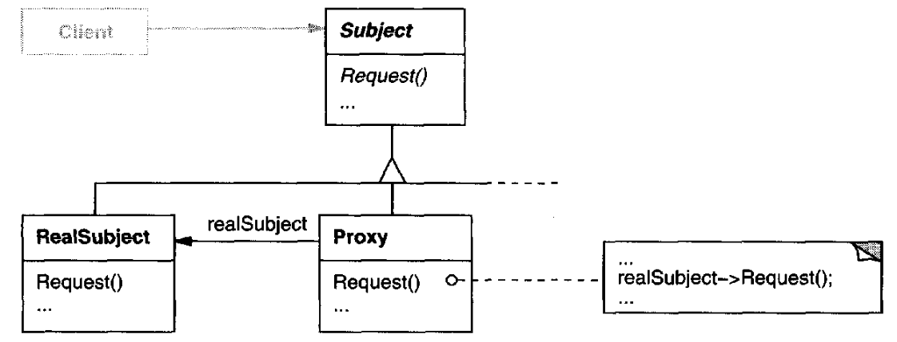
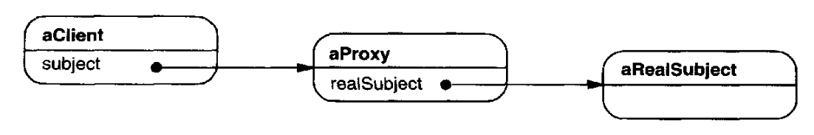
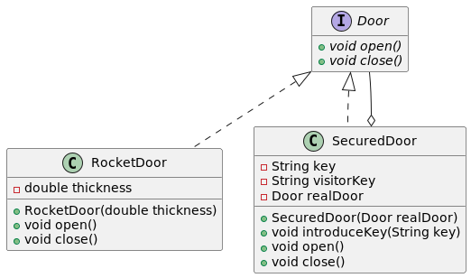

# Proxy

## Intent

Provide a surrogate or placeholder for another object to control access to it.

## Also Known As

Surrogate

## Applicability

*Proxy* is applicable whenever there is a need for a more versatile or sophisticated reference to an object than a simple pointer.

For instance:

* A *remote proxy* provides a local representative for an object in a different address space
* A *virtual proxy* creates expensive objects on demand
* A *protection proxy* controls access to the original object. Protection proxies are useful when objects should have different access rights
* A *smart reference* is a replacement for a bare pointer that performs additional actions when an object is accessed. i.e.:
  - counting the number of references to the real object so that it can be freed automatically when there are no more references
  - loading a persistent object into memory when it's first referenced
  - checking that the real object is locked before it's accessed to ensure that no other object can change it

## Structure



The following diagram shows a possible structure of the proxy at run-time:



## Participants

* **`Proxy`**:
  - maintains a reference that lets the proxy access the real subject. `Proxy` may refer to a `Subject` if the `RealSubject` and `Subject` interfaces are the same
  - provides an interface identical to Subject's so that a proxy can by substituted for the real subject
  - controls access to the real subject and may be responsible for creating and deleting it
  - other responsibilities depend on the kind of proxy:
    + *remote proxies* are responsible for encoding a request and its arguments and for sending the encoded request to the real subject in a different address space
    + virtual proxies may cache additional information about the real subject so that they can postpone accessing it
    + *protection proxies* check that the caller has the access permissions required to perform a request
* **`Subject`**: defines the common interface for `RealSubject` and `Proxy` so that a `Proxy` can be used anywhere a `RealSubject` is expected
* **`RealSubject`**: defines the real object that the proxy represents

## Collaborations

`Proxy` forwards requests to `RealSubject` when appropriate, depending on the kind of proxy

## Consequences

The Proxy pattern introduces a level of indirection when accessing an object. The additional indirection has many uses, depending on the kind of proxy:

* A remote proxy can hide the fact that an object resides in a different address space
* A virtual proxy can perform optimizations such as creating an object on demand
* Both protection proxies and smart references allow additional housekeeping tasks when an object is accessed

## Related Patterns

*Adapter*: An adapter provides a different interface to the object it adapts. In contrast, a proxy provides the same interface as its subject. However, a proxy used for access protection might refuse to perform an operation that the subject will perform, so its interface may be effectively a subset of the subject's.

*Decorator*: Although decorators can have similar implementations as proxies, decorators have a different purpose. A decorator adds one or more responsibilities to an object, whereas a proxy controls access to an object.

## Example in Java



```java
public interface Door {
    void open();
    void close();
}

public class RocketDoor implements Door {
    @Override
    public void open() {
        System.out.println("Opening rocket door...");
    }
    @Override
    public void close() {
        System.out.println("Closing rocket door...");
    }
}

public class SecuredDoor implements Door {
    private String key = "";
    private String visitorKey = "";
    private final Door realDoor;

    public SecuredDoor(String key, Door realDoor) {
        this.key = key;
        this.realDoor = realDoor;
    }

    @Override
    public void open() {
        if (visitorKey.equals(key)) {
            realDoor.open();
        }
        else {
            System.out.println("You cannot open this door");
        }
    }

    public void introduceKey(String key) {
        visitorKey = key;
    }

    @Override
    public void close() {
        if (visitorKey.equals(key)) {
            realDoor.close();
        }
        else {
            System.out.println("You cannot open this door");
        }
    }
}

// --

public final class Client {
    public static void main(String[] args) {
        SecuredDoor securedRocketDoor = new SecuredDoor("Secret", new RocketDoor());

        securedRocketDoor.open();                   // You cannot open this door

        securedRocketDoor.introduceKey("Secret");
        securedRocketDoor.open();                   // Opening rocket door...
        securedRocketDoor.close();                  // Closing rocket door...
    }
}
```
