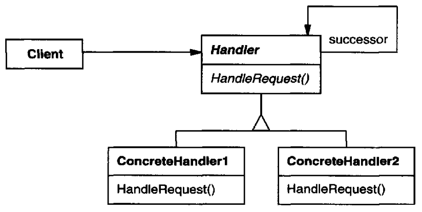
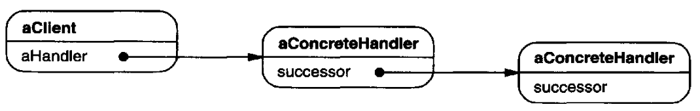
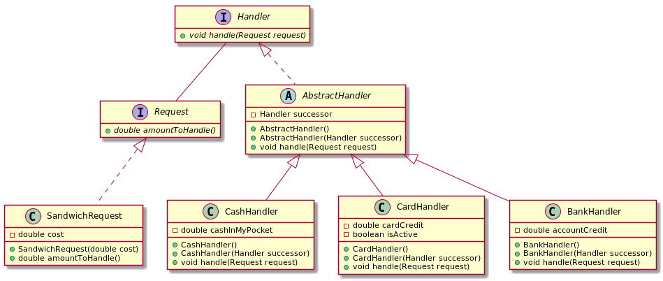

# Chain of Responsability

## Intent

Avoid coupling the sender of a request to its receiver by giving more than one object a chance to handle the request. Chain the receiving objects and pass the request along the chain until an object handles it.

## Applicability

* more than one object may handle a request, and the handler isn't known a *priori*. The handler should be ascertained automatically.
* you want to issue a request to one of several objects without specifying the receiver explicitly.
* the set of objects that can handle a request should be specified dynamically.

## Structure



The following diagram shows a possible object structure:



## Participants

* **`Handler`**:
  - defines an interface for handling requests
  - (optional) implements the successor link
* **`ConcreteHandler`**:
  - handles requests it is responsible for
  - can access its successor
  - if the ConcreteHandler can handle the request, it does so; otherwise it forwards the request to its successor
* **`Client`**: initiates the request to a ConcreteHandler object on the chain

## Collaborations

When a client issues a request, the request propagates along the chain until a `ConcreteHandler` object takes responsibility for handling it.

## Consequences

* Reduced coupling
* Added flexibility in assigning responsibilities to objects
* Receipt isn't guaranteed

## Related Patterns

Chain of Responsibility is often applied in conjunction with Composite. There, a component's parent can act as its successor.

## Example in Java



```java
public interface Request {
    double amountToHandle();
}

public class SandwichRequest implements Request {
    private final double cost;

    public SandwichRequest(double cost) {
        this.cost = cost;
    }

    @Override
    public double amountToHandle() {
        return cost;
    }
}

public interface Handler {
    void handle(Request request);
}

public class AbstractHandler implements Handler {
    protected final Handler successor;

    public AbstractHandler() {
        this(null);
    }

    public AbstractHandler(Handler successor) {
        this.successor = successor;
    }

    @Override
    public void handle(Request request) {
        if (successor != null) {            // by default call successor handler
            successor.handle(request);
        }
        else {
            System.out.println("No proper handler found");
        }
    }
}

public class BankHandler extends AbstractHandler {
    private double accountCredit = 100;

    public BankHandler() {
    }

    public BankHandler(Handler successor) {
        super(successor);
    }

    @Override
    public void handle(Request request) {
        if (accountCredit >= request.amountToHandle()) {
            System.out.println("Paid with bank account");
        }
        else {
            super.handle(request);
        }
    }
}

public class CardHandler extends AbstractHandler {
    private double cardCredit = 20;
    private boolean isActive = true;

    public CardHandler() {
        super();
    }

    public CardHandler(Handler successor) {
        super(successor);
    }

    @Override
    public void handle(Request request) {
        if (isActive && cardCredit >= request.amountToHandle()) {
            System.out.println("Paid with card");
        }
        else {
            System.out.println("Card forwarding...");
            // some processing might be done with successor such as logging
            successor.handle(request);
        }
    }
}

public class CashHandler extends AbstractHandler {
    private double cashInMyPocket = 10;

    public CashHandler() {
    }

    public CashHandler(Handler successor) {
        super(successor);
    }

    @Override
    public void handle(Request request) {
        if (cashInMyPocket >= request.amountToHandle()) {
            System.out.println("Paid with cash");
        }
        else {
            super.handle(request);
        }
    }
}

// --

public class Client {
    public static void main(String[] args) {
        Handler bank = new BankHandler();
        Handler card = new CardHandler(bank);
        Handler cash = new CashHandler(card);

        cash.handle(new SandwichRequest(30));       // Card forwarding...
                                                    // Paid with bank account
        System.out.println();                       // ----------
        cash.handle(new SandwichRequest(400));      // Card forwarding...
                                                    // No proper handle found
    }
}
```
