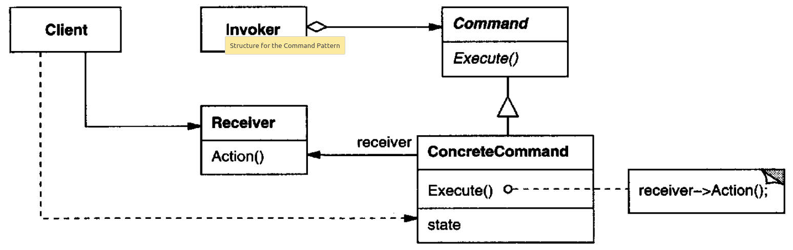
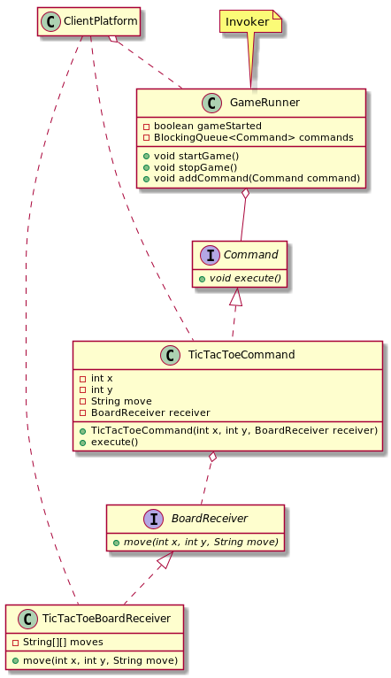

# Command

## Intent

Encapsulate a request as an object, thereby letting you parameterize clients with different requests, queue or log requests, and support undoable operations.

## Also Known As

Action, Transaction

## Applicability

* Parameterize objects by an action to perform. You can express such parameterization in a procedural language with a *callback* function, that is, a function that's registered somewhere to be called at a later point. *Commands* are an object-oriented replacement for callbacks.
* Specify, queue, and execute requests at different times. A *Command* object can have a lifetime independent of the original request. If the receiver of a request can be represented in an address space-independent way, then you can transfer a command object for the request to a different process and fulfill the request there.
* Support undo. The Command's *`execute`* operation can store state for reversing its effects in the command itself. The Command interface must have an added *`unexecute`* operation that reverses the effects of a previous call to `execute`. Executed commands are stored in a history list. Unlimited-level undo and redo is achieved by traversing this list backwards and forwards calling `unexecute` and `execute`, respectively.
* Support logging changes so that they can be reapplied in case of a system crash.
* structure a system around high-level operations built on primitives operations.

## Structure



## Participants

* **`Command`**: declares an interface for executing an operation
* **`ConcreteCommand`**:
  - defines a binding between a `Receiver` object and an action
  - implements `execute` by invoking the corresponding operation(s) on `Receiver`
* **`Client`**: creates a ConcreteCommand object and sets its receiver
* **`Invoker`**: asks the command to carry out the request
* **`Receiver`**: knows how to perform the operations associated with carrying out a request. Any class may serve as a `Receiver`

## Collaborations

* The client creates a `ConcreteCommand` object and specifies its receiver
* An `Invoker` object stores the `ConcreteCommand` object
* The invoker issues a request by calling `execute` on the command. When commands are undoable, `ConcreteCommand` stores state for undoing the command prior to invoking `execute`.
* The `ConcreteCommand` object invokes operations on its receiver to carry out the request

## Consequences

* *Command* decouples the object that invokes the operation from the one that knows how to perform it
* Commands are first-class objects. They can be manipulated and extended like any other object
* You can assemble commands into a composite command
* It's easy to add new Commands, because you don't have to change existing classes

## Related Patterns

* A *Composite* can be used to implement *MacroCommands*
* A Memento can keep state the command requires to undo its effect
* A command that must be copied before being placed on the history list acts as a *Prototype*

## Example in Java



```java
public interface BoardReceiver {
    void move(int x, int y, String move);
}

public final class TicTacToeBoardReceiver implements BoardReceiver {
    private String[][] moves = new String[3][3];

    public void move(int x, int y, String move) {
        if (moveIsValid(x, y, move)) {
            makeMove(x, y, move);
        }
    }

    private boolean moveIsValid(int x, int y, String move) {
        // validation implementation goes here
        return true;
    }

    private void makeMove(int x, int y, String move) {
        moves[x][y] = move;
    }
}

public interface Command {
    void execute();
}

public final class TicTacToeCommand implements Command {
    private final int x;
    private final int y;
    private final String move;
    private final BoardReceiver boardReceiver;

    public TicTacToeCommand(int x, int y, String move, BoardReceiver boardReceiver) {
        this.x = x;
        this.y = y;
        this.move = move;
        this.boardReceiver = boardReceiver;
    }

    @Override
    public void execute() {
        boardReceiver.move(x, y, move);
    }
}

public final class GameRunner {
    private static final Logger LOGGER = Logger.getAnonymousLogger();

    private volatile boolean gameStarted;
    private final BlockingQueue<Command> commands = new LinkedBlockingDeque<>();

    public synchronized void startGame() {
        gameStarted = true;
        try {
            while (gameStarted) {
                commands.take().execute();
            }
        } catch (InterruptedException exception) {
            LOGGER.log(Level.SEVERE, exception.getLocalizedMessage());
            Thread.currentThread().interrupt();
        }
    }

    public synchronized void stopGame() {
        gameStarted = false;
    }

    public void addCommand(Command command) {
        commands.add(command);
    }
}

// --

public final class ClientPlatform {
    public static void main(String[] args) {
        GameRunner gameRunner = new GameRunner();
        gameRunner.startGame();

        BoardReceiver ticTacToeReceiver = new TicTacToeBoardReceiver();

        Command ticTacToeMoveCommand1 = new TicTacToeCommand(0, 0, "X",ticTacToeReceiver);
        Command ticTacToeMoveCommand2 = new TicTacToeCommand(1, 0, "O",ticTacToeReceiver);
        Command ticTacToeMoveCommand3 = new TicTacToeCommand(0, 1, "X",ticTacToeReceiver);
        Command ticTacToeMoveCommand4 = new TicTacToeCommand(1, 1, "O",ticTacToeReceiver);
        Command ticTacToeMoveCommand5 = new TicTacToeCommand(0, 2, "X",ticTacToeReceiver); // win

        gameRunner.addCommand(ticTacToeMoveCommand1);
        gameRunner.addCommand(ticTacToeMoveCommand2);
        gameRunner.addCommand(ticTacToeMoveCommand3);
        gameRunner.addCommand(ticTacToeMoveCommand4);
        gameRunner.addCommand(ticTacToeMoveCommand5);

        gameRunner.stopGame();
    }
}
```
