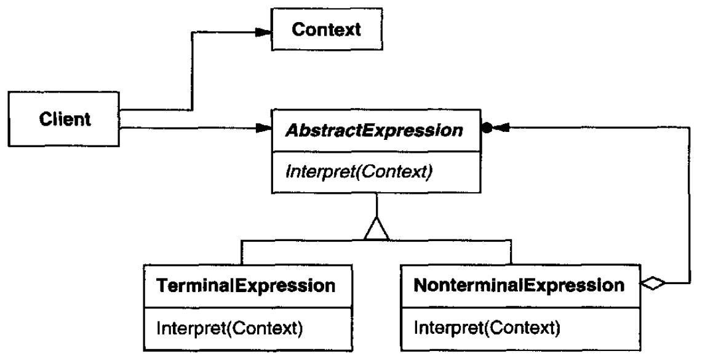

# Interpreter

## Intent

Given a language, define a represention for its grammar along with an interpreter that uses the representation to interpret sentences in the language.

## Applicability

Use the *Interpreter* pattern when there is a language to interpret, and you can represent statements in the language as abstract syntax trees. It works best when the grammar is simple and efficiency is not a critical concern.

## Structure

## Participants

* **`AbstractExpression`**: declares an abstract `interpret` operation that is common to all nodes in the abstract syntax tree
* **`TerminalExpression`**:
  - implements an `interpret` operation associated with terminal symbols in the grammar
  - an instance is required for every terminal symbol in a sentence
* **`NonterminalExpression`**:
  - one such class is required for every rule `R ::= R``1``R``2`...`R``n` in the grammar
  - maintains instance variables of type `AbstractExpression` for each of the symbols `R``1` through `R``n`
  - implements an `interpret` operation for nonterminal symbols in the grammar. `interpret` typically calls itself recursively on the variables representing `R``1` through `R``n`
* **`Context`**: contains information that's global to the interpreter
* **`Client`**:
  - builds (or is given) an abstract syntax tree representing a particular sentence in the language that the grammar defines. The abstract syntax tree is assembled from instances of the `NonterminalExpression` and `TerminalExpression` classes
  - invokes the `interpret` operation

## Collaborations

* The client builds (or is given) the sentence as an abstract syntax tree of `NonterminalExpression` and `TerminalExpression` instances. Then the client initializes the context and invokes the `interpret` operation
* Each `NonterminalExpression` node defines `interpret` in terms of `interpret` on each subexpression. The Interpret operation of each `TerminalExpression` defines the base case in the recursion
* The `interpret` operations at each node use the context to store and access the state of the interpreter

## Consequences

* It's easy to change and extend the grammar
* Implementing the grammar is easy, too
* Complex grammars are hard to maintain
* Adding new ways to interpret expressions is easy
* If you keep creating new ways of interpreting an expression, then consider using the *Visitor* pattern to avoid changing the grammar classes

## Related Patterns

* *Composite*: The abstract syntax tree is an instance of the Composite pattern
* *Flyweight*: shows how to share terminal symbols within the abstract syntax tree
* *Iterator*: The interpreter can use an Iterator to traverse the structure
* *Visitor* can be used to maintain the behavior in each node in the abstract syntax tree in one class
