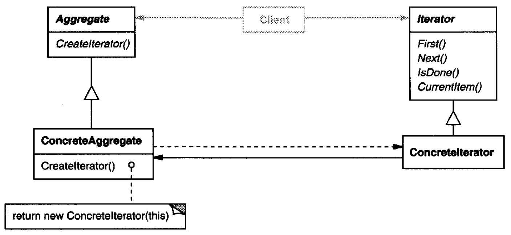
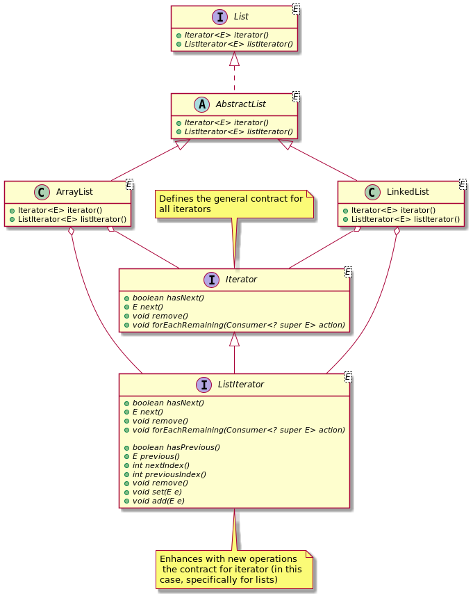

# Iterator

## Intent

Provide a way to access the elements of an aggregate object sequentially without exposing its underlying representation.

## Also Known As

Cursor

## Applicability

* to access an aggregate object's contents without exposing its internal representation
* to support multiple traversals of aggregate objects
* to provide a uniform interface for traversing different aggregate structures (that is, to support polymorphic iteration)

## Structure



## Participants

* **`Iterator`**: defines an interface for accessing and traversing elements
* **`Concretelterator`**:
  - implements the `Iterator` interface
  - keeps track of the current position in the traversal of the aggregate
* **`Aggregate`**: defines an interface for creating an `Iterator` object
* **`ConcreteAggregate`**: implements the `Iterator` creation interface to return an instance of the proper `Concretelterator`

## Collaborations

A `Concretelterator` keeps track of the current object in the aggregate and can compute the succeeding object in the traversal

## Consequences

* It supports variations in the traversal of an aggregate
* Iterators simplify the `Aggregate` interface
* More than one traversal can be pending on an aggregate

## Related Patterns

* *Composite*: Iterators are often applied to recursive structures such as Composites.
* *Factory Method*: Polymorphic iterators rely on factory methods to instantiate the appropriate Iterator subclass.
* *Memento* is often used in conjunction with the Iterator pattern. An iterator can use a memento to capture the state of an iteration. The iterator stores the memento internally.

## Example in Java



```java
```
