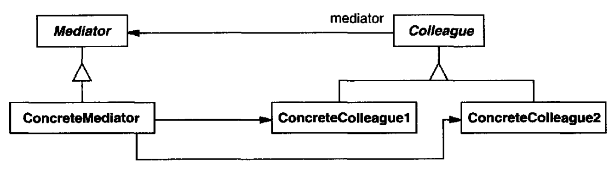
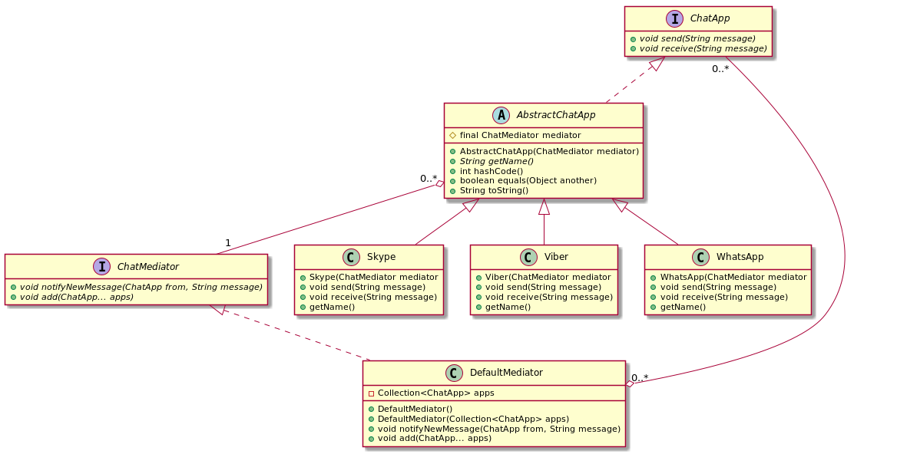

# Mediator

## Intent

Define an object that encapsulates how a set of objects interact. Mediator promotes loose coupling by keeping objects from referring to each other explicitly, and it lets you vary their interaction independently.

## Applicability

* a set of objects communicate in well-defined but complex ways. The resulting interdependencies are unstructured and difficult to understand.
* reusing an object is difficult because it refers to and communicates with many other objects.
* a behavior that's distributed between several classes should be customizable without a lot of subclassing.

## Structure



## Participants

* **`Mediator`**: defines an interface for communicating with `Colleague` objects
* **`ConcreteMediator`**:
  - implements cooperative behavior by coordinating Colleague objects
  - knows and maintains its colleagues
* **`Colleague` classes**:
  - each `Colleague` class knows its `Mediator` object
  - each colleague communicates with its mediator whenever it would have otherwise communicated with another colleague

## Collaborations

`Colleague`s send and receive requests from a `Mediator` object. The mediator implements the cooperative behavior by routing requests between the appropriate colleague(s).

## Consequences

* It limits subclassing
* It decouples colleagues
* It simplifies object protocols
* It abstracts how objects cooperate
* It centralizes control

## Related Patterns

*Facade* differs from *Mediator* in that it abstracts a subsystem of objects to provide a more convenient interface. Its protocol is unidirectional; that is, *Facade* objects make requests of the subsystem classes but not vice versa. In contrast, *Mediator* enables cooperative behavior that colleague objects don't or can't provide, and the protocol is multidirectional.

Colleagues can communicate with the mediator using the *Observer* pattern.

## Example in Java



```java
```
