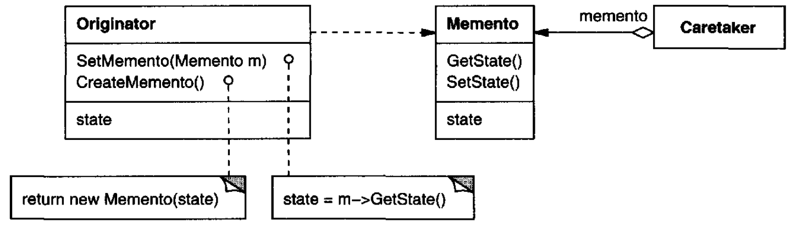
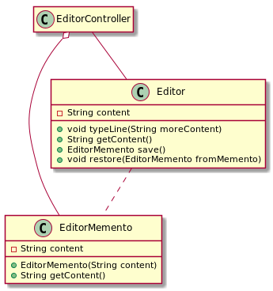

# Memento

## Intent

Without violating encapsulation, capture and externalize an object's internal state so that the object can be restored to this state later.

## Also Known As

Token

## Applicability

* a snapshot of (some portion of) an object's state must be saved so that it can be restored to that state later, *and*
* a direct interface to obtaining the state would expose implementation details and break the object's encapsulation

## Structure



## Participants

* **`Memento`**:
  - stores internal state of the `Originator` object. The memento may store as much or as little of the originator's internal state as necessary at its originator's discretion.
  - protects against access by objects other than the originator. Mementos have effectively two interfaces. `Caretaker` sees a *narrow* interface to the `Memento`—it can only pass the memento to other objects. `Originator`, in contrast, sees a *wide* interface, one that lets it access all the data necessary to restore itself to its previous state. Ideally, only the originator that produced the memento would be permitted to access the memento's internal state.
* **`Originator`**
  - creates a memento containing a snapshot of its current internal state.
  - uses the memento to restore its internal state.
* **`Caretaker`**
  - is responsible for the memento's safekeeping.
  - never operates on or examines the contents of a memento.

## Collaborations

* A caretaker requests a memento from an originator, holds it for a time, and passes it back to the originator. Sometimes the caretaker won't pass the memento back to the originator, because the originator might never need to revert to an earlier state.
* Mementos are passive. Only the originator that created a memento will assign or retrieve its state.

## Consequences

* It helps in preserving encapsulation boundaries
* It simplifies Originator
* Using mementos might be expensive
* It may be difficult in some languages to ensure that only the originator can access the memento's state
* A caretaker might incur hidden costs in caring for mementos

## Related Patterns

* *Command*s can use mementos to maintain state for undoable operations.
* *Iterator*: Mementos can be used for iteration as described earlier.

## Example in Java



```java
public class EditorMemento {
    private final String content;

    public EditorMemento(String content) {
        this.content = content;
    }

    public String getContent() {
        return content;
    }
}

public class Editor {
    private String content = "";

    public void typeLine(String moreContent) {
        content += moreContent + System.lineSeparator();
    }

    public String getContent() {
        return content;
    }

    public EditorMemento save() {
        return new EditorMemento(content);
    }

    public void restore(EditorMemento fromMemento) {
        content = fromMemento.getContent();
    }
}

// --

public class EditorController {
    public static void main(String[] args) {
        Editor editor = new Editor();
        editor.typeLine("Hello");
        editor.typeLine("World");

        EditorMemento memento = editor.save();

        editor.typeLine("Some more content");
        System.out.println(editor.getContent());    // Hello
                                                    // World
                                                    // Some more content

        editor.restore(memento);

        System.out.println(editor.getContent());    // Hello
                                                    // World
    }
}
```
