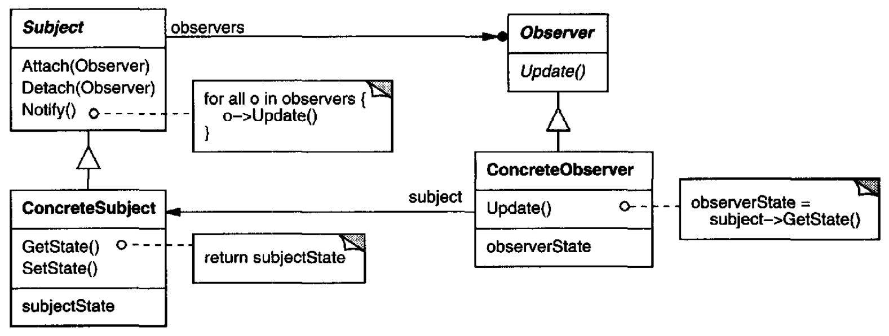
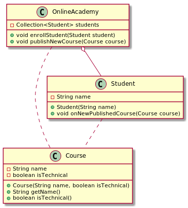

# Observer

## Intent

Define a one-to-many dependency between objects so that when one object changes state, all its dependents are notified and updated automatically.

## Also Known As

Dependents, Publish-Subscribe

## Applicability

* When an abstraction has two aspects, one dependent on the other. Encapsulating these aspects in separate objects lets you vary and reuse them inde pendently.
* When a change to one object requires changing others, and you don't know how many objects need to be changed.
* When an object should be able to notify other objects without making assumptions about who these objects are. In other words, you don't want these objects tightly coupled.


## Structure



## Participants

* **`Subject`**
  - knows its observers. Any number of `Observer` objects may observe a subject.
  - provides an interface for attaching and detaching `Observer` objects.
* **`Observer`**: defines an updating interface for objects that should be notified of changes in a subject.
* **`ConcreteSubject`**
  - stores state of interest to `ConcreteObserver` objects.
  - sends a notification to its observers when its state changes.
* **`ConcreteObserver`**
  - maintains a reference to a `ConcreteSubject` object.
  - stores state that should stay consistent with the subject's.
  - implements the `Observer` updating interface to keep its state consistent with the subject's.

## Collaborations

* `ConcreteSubject` notifies its observers whenever a change occurs that could make its observers' state inconsistent with its own.
* After being informed of a change in the concrete subject, a `ConcreteObserver` object may query the subject for information. `ConcreteObserver` uses this information to reconcile its state with that of the subject.

## Consequences

* The Observer pattern lets you vary subjects and observers independently
* You can reuse subjects without reusing their observers, and vice versa
* It lets you add observers without modifying the subject or other observers
* Abstract coupling between `Subject` and `Observer`
* Support for broadcast communication
* Unexpected updates

## Example in Java



```java
```
