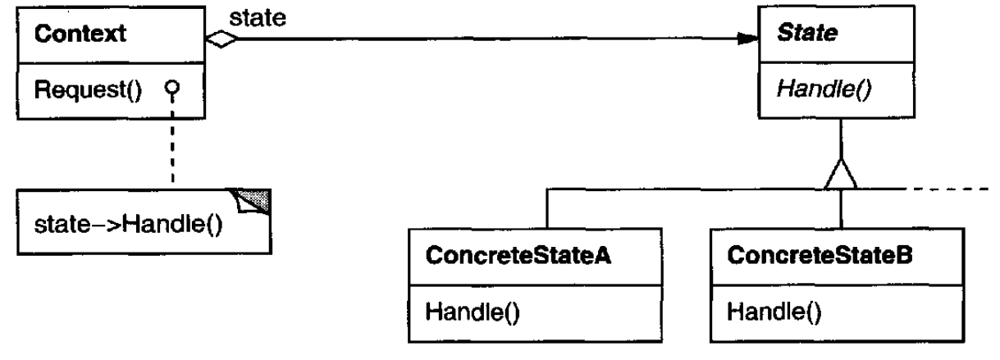
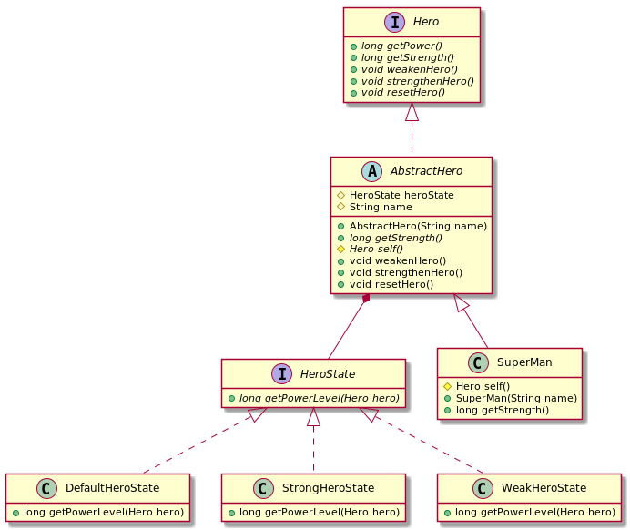

# State

## Intent

Allow an object to alter its behavior when its internal state changes. The object will appear to change its class.

## Also Known As

Objects for States

## Applicability

* An object's behavior depends on its state, and it must change its behavior at run-time depending on that state.
* Operations have large, multipart conditional statements that depend on the object's state. This state is usually represented by one or more enumerated constants. Often, several operations will contain this same conditional structure. The *State* pattern puts each branch of the conditional in a separate class. This lets you treat the object's state as an object in its own right that can vary independently from other objects.


## Structure



## Participants
* **`Context`**
  - defines the interface of interest to clients
  - maintains an instance of a `ConcreteState` subclass that defines the current state
* **`State`**: defines an interface for encapsulating the behavior associated with a particular state of the `Context`
* **`ConcreteState` subclasses**: each subclass implements a behavior associated with a state of the `Context`

## Collaborations

* `Context` delegates state-specific requests to the current `ConcreteState` object
* A context may pass itself as an argument to the `State` object handling the request. This lets the `State` object access the context if necessary
* `Context` is the primary interface for clients. Clients can configure a context with `State` objects. Once a context is configured, its clients don't have to deal with the `State` objects directly
* Either `Context` or the `ConcreteState` subclasses can decide which state succeeds another and under what circumstances

## Consequences

* It localizes state-specific behavior and partitions behavior for different states
* It makes state transitions explicit
* State objects can be shared

## Related Patterns

* The *Flyweight* pattern explains when and how *State* objects can be shared
* *State* objects are often *Singletons*



```java
public interface HeroState {
    long getPowerLevel(Hero hero);
}

public class DefaultHeroState implements HeroState {
    @Override
    public long getPowerLevel(Hero hero) {
        return hero.getStrength();
    }
}

public class StrongHeroState implements HeroState {
    @Override
    public long getPowerLevel(Hero hero) {
        return hero.getStrength() + 100;
    }
}

public class WeakHeroState implements HeroState {
    @Override
    public long getPowerLevel(Hero hero) {
        return hero.getStrength() - 100;
    }
}

public interface Hero {
    long getPower();
    long getStrength();
    void weakenHero();
    void strengthenHero();
    void resetHero();
}

public abstract class AbstractHero implements Hero {
    protected HeroState heroState = new DefaultHeroState();
    private String name;

    public AbstractHero(String name) {
        this.name = name;
    }

    @Override
    public long getPower() {
        return heroState.getPowerLevel(self());
    }

    protected abstract Hero self();

    public void weakenHero() {
        this.heroState = new WeakHeroState();
    }

    public void strengthenHero() {
        this.heroState = new StrongHeroState();
    }

    public void resetHero() {
        this.heroState = new DefaultHeroState();
    }
}

public class SuperMan extends AbstractHero {
    public SuperMan(String name) {
        super(name);
    }

    @Override
    protected Hero self() {
        return this;
    }

    @Override
    public long getStrength() {
        return 150;
    }
}

// --

public class Main {
    public static void main(String[] args) {
        Hero hero = new SuperMan("S");
        System.out.println(hero.getPower());    // 150

        hero.weakenHero();
        System.out.println(hero.getPower());    // 50

        hero.strengthenHero();
        System.out.println(hero.getPower());    // 250

        hero.resetHero();
        System.out.println(hero.getPower());    // 150
    }
}
```
