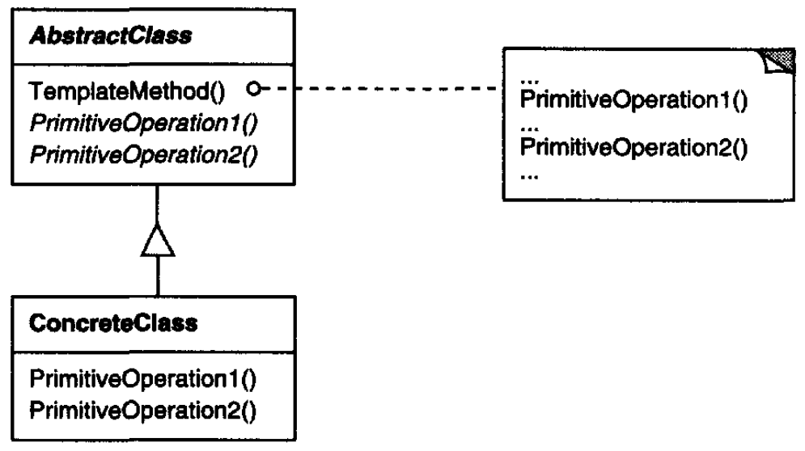
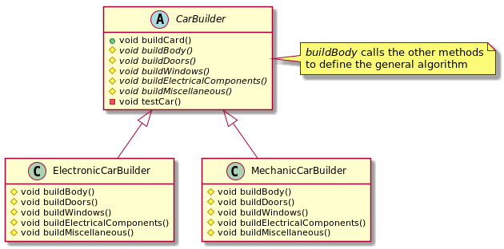

# Template Method

## Intent

Define the skeleton of an algorithm in an operation, deferring some steps to subclasses. Template Method lets subclasses redefine certain steps of an algorithm without changing the algorithm's structure.

## Applicability

* to implement the invariant parts of an algorithm once and leave it up to subclasses to implement the behavior that can vary.
* when common behavior among subclasses should be factored and localized in a common class to avoid code duplication.
* to control subclasses extensions. You can define a template method that calls "hook" operations at specific points, thereby permitting extensions only at those points.

## Structure



## Participants

* **`AbstractClass`**
  - defines abstract *primitive operations* that concrete subclasses define to implement steps of an algorithm.
  - implements a template method defining the skeleton of an algorithm. The template method calls primitive operations as well as operations defined in `AbstractClass` or those of other objects.
* **`ConcreteClass`**
  - implements the *primitive operations* to carry out subclass-specific steps of the algorithm.

## Collaborations

`ConcreteClass` relies on `AbstractClass` to implement the invariant steps of the algorithm.

## Consequences

Template methods are a fundamental technique for code reuse. They are particularly important in class libraries, because they are the means for factoring out common behavior in library classes.

Template methods lead to an inverted control structure, that is, *"Don't call us, we'll call you"*. This refers to how a parent class calls the operations of a subclass and not the other way around.

Template methods call the following kinds of operations:

* concrete operations (either on the `ConcreteClass` or on client classes);
* concrete `AbstractClass` operations (i.e., operations that are generally useful to subclasses);
* primitive operations (i.e., abstract operations);
* factory methods, and
* *hook operations*, which provide default behavior that subclasses can extend if necessary. A hook operation often does nothing by default.

It's important for template methods to specify which operations are hooks (may be overridden) and which are abstract operations (must be overridden).

## Related Patterns

*Factory Methods* are often called by template methods.

*Strategy*: Template methods use inheritance to vary part of an algorithm. Strategies use delegation to vary the entire algorithm.

## Example in Java



```java
public abstract class CarBuilder {
    void buildCard() {
        buildBody();
        buildDoors();
        buildWindows();
        buildElectricalComponents();
        buildMiscellaneous();
        testCar();
    }

    protected abstract void buildMiscellaneous();

    protected abstract void buildElectricalComponents();

    protected abstract void buildWindows();

    protected abstract void buildDoors();

    protected abstract void buildBody();

    private void testCar() {
        System.out.println("Testing!");
    }
}

public class ElectronicCarBuilder  extends CarBuilder {
    @Override
    protected void buildMiscellaneous() {
        System.out.println("electronic misc");
    }

    @Override
    protected void buildElectricalComponents() {
        System.out.println("electrical comps");
    }

    @Override
    protected void buildWindows() {
        System.out.println("windows for an electrical car");
    }

    @Override
    protected void buildDoors() {
        System.out.println("cool automatic doors");
    }

    @Override
    protected void buildBody() {
        System.out.println("a great body for an electrical car");
    }
}

public class MechanicalCarBuilder extends CarBuilder {
    @Override
    protected void buildMiscellaneous() {
        System.out.println("mechanic misc");
    }

    @Override
    protected void buildElectricalComponents() {
        System.out.println("electric comps for a mechanic car");
    }

    @Override
    protected void buildWindows() {
        System.out.println("windows for a mechanic car");
    }

    @Override
    protected void buildDoors() {
        System.out.println("manual-opening doors");
    }

    @Override
    protected void buildBody() {
        System.out.println("a heavy duty body");
    }
}
```
