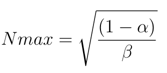
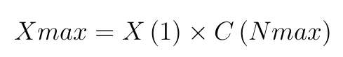

# Chapter I: Introduction

## 1. Preface

### 1.1 The database server and the connectivity layer

All data access frameworks rely on JDBC (Java Database Connectivity) API for communicating to a database server.

### 1.2 The application data access layer

### 1.2.2 The native query builder framework

JPA (Java Persistence API) and Hibernate were never meant to substitute SQL.

While JPA makes it possible to abstract DML statements and common entity retrieval queries, when it comes to reading and processing data, nothing can beat native SQL.

JPQL (Java Persistence Querying Language) abstracts the common SQL syntax by subtracting database specific querying features, so it lacks support for Window Functions, Common Table Expressions, Derived tables or PIVOT.

As opposed to JPA, jOOQ (Java Object Oriented Query) embraces database specific query features, and it provides a type-safe query builder which can protect the application against SQL injection attacks even for dynamic native queries.

## 2. Performance and Scaling

### 2.1 Response time and throughput

Throughput is defined as the rate of completing incoming load. In a database context, throughput can be calculated as the number of transactions executed within a given time interval.

[USL (Universal Scalability Law)](http://www.perfdynamics.com/Manifesto/USLscalability.html) can approximate the maximum relative throughput (system capacity) in relation to the number of load generators (database connections).

```
C (N) = N / (1 + α (N − 1) + βN (N − 1))
```

* C - the relative throughput gain for the given concurrency level
* α - the contention coefficient (the serializable portion of the data processing routine)
* β - the coherency coefficient (the cost for maintaining consistency across all concurrent database sessions)

When the coherency coefficient is zero, USL overlaps with [Amdahl’s Law](https://en.wikipedia.org/wiki/Amdahl%27s_law).

The number of load generators (database connections), for which the system hits its maximum capacity, depends on the USL coefficients solely.



The resulting capacity gain is relative to the minimum throughput, so the absolute system capacity is obtained as follows:


